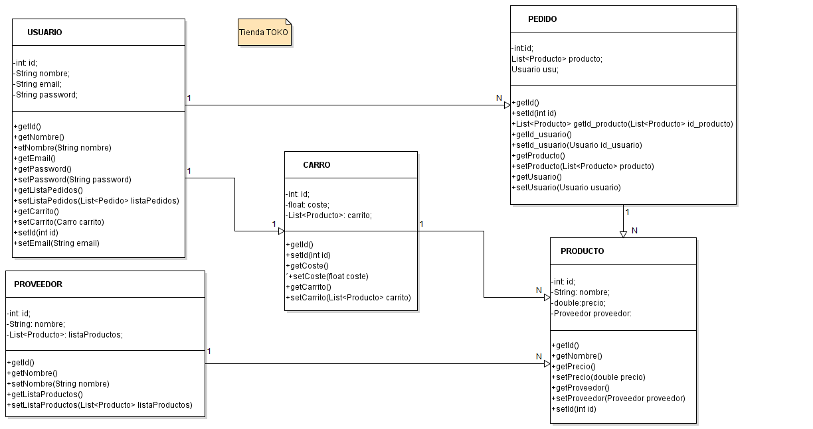

# Nombre de la aplicacion web.
TOKO-Ñ
## Descripción de la temática.

La aplicación que se pretende hacer consiste en una tienda online donde nuestros productos podrán ser vistos por usuarios no registrados pudiendo incluso ser añadidos al carrito de compra, además de saber antes de formalizar
la compra si hay stock o debera esperar a que la empresa reciba el producto, pero para que el usuario formalice la compra, debe primero registrarse y asi poder conseguir acceso a la pasarela de pago.

## Enumeración y descripción de entidades principales.

-Usuario(privado): Nombre, lista de productos del carrito, numero de tarjeta, Lista de pedidos
-Pedido(privado): Lista de productos pagados
-Carrito(privado): Lista de productos
-Tienda(público): Productos que se tienen o tendran
-Stock(público): Productos que actualmente se tienen
-Producto(público): Objetos disponibles para su compra

## Descripción del servicio interno.

Login, proceso de pago, pedido.

En esta aplicación web tenemos pensado que el servicio interno se encargue de la realización del login, si el usuario quiere realizarlo.
Decidir que información mostrar al usuario dependiendo de las acciones que haya realizado y tambien dependiendo de si ha realizado el login o no.
Realizar el manejo de las estructuras de datos del usuario y la tienda ya sea insertar productos en el carro del usuario o añadir más productos al stock, etc...
En caso de realizar una compra se encargará de verificar que el usuario esté logueado y manejará el proceso de pago.

 

## Equipo de desarrollo.
Nombre y Apellidos | e-mail | GitHub
-------------------|----------------------|-----------------
:man_student: Darwin Chumapi Granda | :e-mail: ds.chumapi.2017@alumnos.urjc.es | https://github.com/DSCHG
:man_student: Javier Rubio López | :e-mail: j.rubiol.2017.2017@alumnos.urjc.es |https://github.com/JaviRubi
:man_student: Eva María Hoyo de la Cruz | :e-mail:  em.hoyo@alumnos.urjc.es  |  https://github.com/Eva87

### Trello
https://trello.com/b/QmLREBu5/practica-dad

