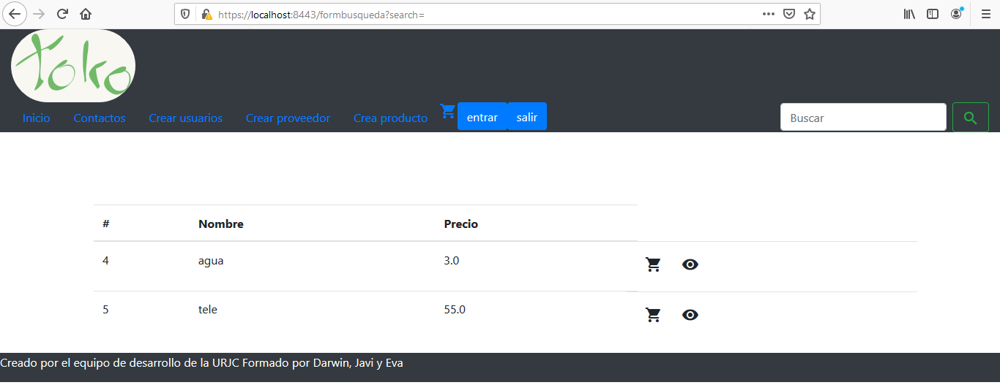

# Nombre de la aplicacion web.
TOKO
## Descripción de la temática.

La aplicación que se pretende hacer consiste en una tienda online donde nuestros productos podrán ser vistos por usuarios no registrados pudiendo incluso ser añadidos al carrito de compra, además de saber antes de formalizar
la compra si hay stock o debera esperar a que la empresa reciba el producto, pero para que el usuario formalice la compra, debe primero registrarse y asi poder conseguir acceso a la pasarela de pago.

## Enumeración y descripción de entidades principales.

- Usuario(privado): Nombre, contraseña, email, lista de productos del carrito, numero de tarjeta, Lista de pedidos
- Pedido(privado): Lista de productos pagados.
- Carrito(privado): Lista de productos seleccionados por el usuario.
- Proveedor(público): Productos que se tienen o tendran de un distribuidor determinado.
- Producto(público): Objetos disponibles para su compra y el stock de los mismos

## Esquema E/R.

 

## Descripción del servicio interno.

proceso de pago, pedido.
- Proceso de pago: En el momento de ultimar la compra y el usuario esté logueado, el servicio interno se encargará de actualizar los productos que estén disponibles tras la compra y enviar un correo al usuario, informandole del pedido.

## Equipo de desarrollo.
Nombre y Apellidos | e-mail | GitHub
-------------------|----------------------|-----------------
:man_student: Darwin Chumapi Granda | :e-mail: ds.chumapi.2017@alumnos.urjc.es | https://github.com/DSCHG
:man_student: Javier Rubio López | :e-mail: j.rubiol.2017.2017@alumnos.urjc.es |https://github.com/JaviRubi
:man_student: Eva María Hoyo de la Cruz | :e-mail:  em.hoyo@alumnos.urjc.es  |  https://github.com/Eva87

### Trello
https://trello.com/b/QmLREBu5/practica-dad

## Diagrama vistas

## Descripción de las vistas

- Común a todas las vistas:
En todas las vistas se ve una barra de navegación arriba la cual está compuesta por una serie de botones y un buscador con su botón asociado.
Se ve el logotipo de la empresa (toko), el cual te lleva al index al pulsarlo desde cualquier página.
En orden de izquierda a derecha se ven los botones, y la vista a la que te llevan: Inicio(index), Contacto(contacto), crear usuario(crud), crear proveedor(crudproveedor), crear producto(crudproducto), un icono de un carrito(carrito).  y el botón de búsqueda(crudbusqueda). 
Y al pie de la vista se puede observar el equipo de desarrollo.

- Carrito:
Posee un botón para poder formalizar el pedido y que este sea almacenado en la base de datos.
El carrito esta diseñado para poder introducir articulos de la base de datos en el mismo para luego poder comprarlo mas adelante.

- InfoPedido:
Te muestra la información relativa al pedido

- contacto:
Contiene un texto que indica los datos de contacto de la empresa.

- crud:
Se permite incluir el nombre, el correo y la contraseña del usuario para que se almacene en la base de datos.
Es la pagina que permite incluir usuarios a la base de datos.

- crudbusqueda:
Si al usar el buscador que está en la barra de navegación no se pasa ningún parámetro, te muestra todo el contenido de productos, en caso de pasar parámetros, te busca el producto que coincida en nombre con lo pasado.
Si precisas buscar un articulo es mas sencillo siempre usar un buscador que navegar entre multiples archivos para ver si la empresa lo tiene disponible.

- crudproducto:
Se puede introducir el nombre, el precio y el id_proveedor, y se almacena en la base de datos de productos, incluyendo la referencia al proveedor que lo vende
Esta vista permite incluir en la base de datos productos.

- crudproveedor:
Se puede introducir el nombre, el producto y el precio, y se almacena en la base de datos de proveedores y de productos.
Se permite incluir proveedores en la base de datos.

- index:
Tiene un botón para terminar la navegación por la aplicación.
Es la pagina principal donde se ven al iniciar la lista de los productos incluidos en la base de datos. 

- mostrarPedidos:
Te muestra los pedidos que han sido realizados

- vistaProducto: 
Muestra el producto que se haya seleccionado previamente y el precio del mismo.

## Capturas.

