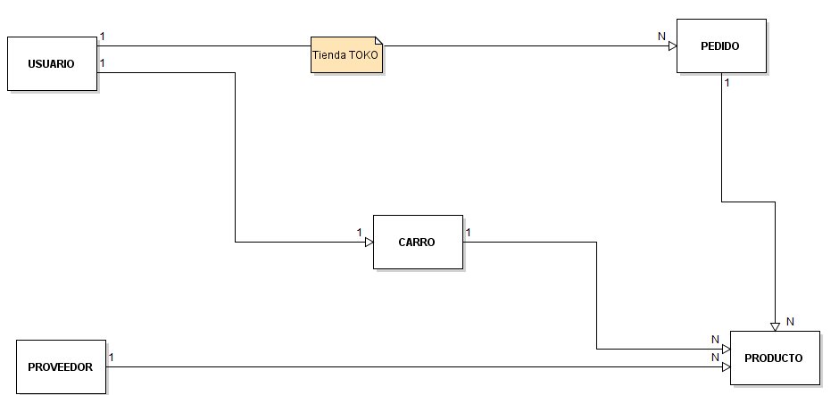
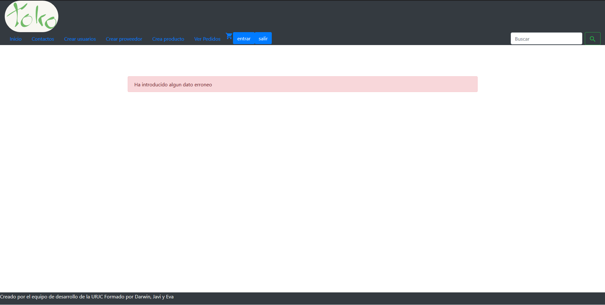
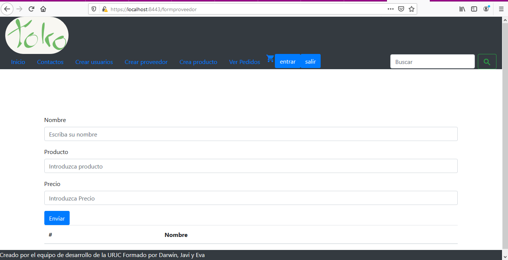
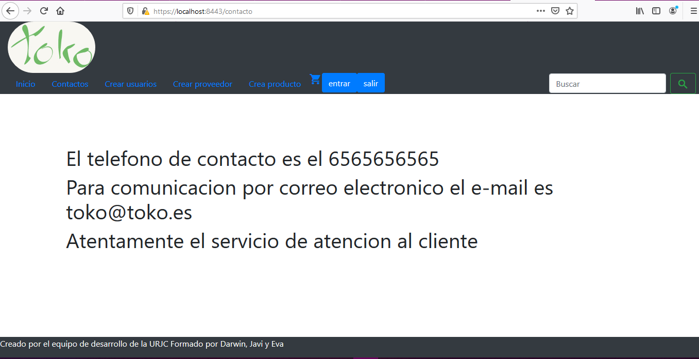
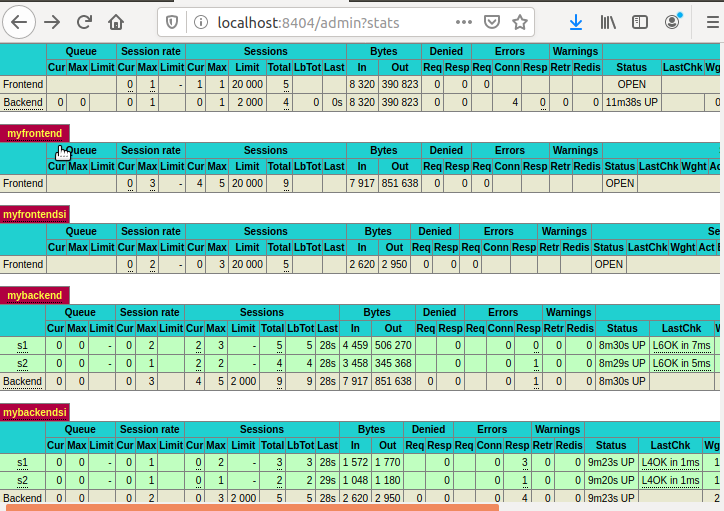

# Nombre de la aplicacion web.
TOKO

## *Video*

<video width="320" height="240" controls>
  <source src="videodadv4.mp4" type="video/mp4">
</video>

%[caption](videodadv4.mp4)

## Descripción de la temática.

La aplicación que se pretende hacer consiste en una tienda online donde nuestros productos podrán ser vistos por usuarios no registrados pudiendo incluso ser añadidos al carrito de compra, además de saber antes de formalizar
la compra si hay stock o debera esperar a que la empresa reciba el producto, pero para que el usuario formalice la compra, debe primero registrarse y asi poder conseguir acceso a la pasarela de pago.

## Enumeración y descripción de entidades principales.

- Usuario(privado): Nombre, contraseña, email, lista de productos del carrito, numero de tarjeta, Lista de pedidos
- Pedido(privado): Lista de productos pagados.
- Carrito(privado): Lista de productos seleccionados por el usuario.
- Proveedor(público): Productos que se tienen o tendran de un distribuidor determinado.
- Producto(público): Objetos disponibles para su compra y el stock de los mismos

## Descripción del servicio interno.

proceso de pago, pedido.
- Proceso de pago: En el momento de ultimar la compra y el usuario esta logueado, el servicio interno envia un correo al usuario, informandole del pedido. Con una factura en pdf.**

## Equipo de desarrollo.
Nombre y Apellidos | e-mail | GitHub
-------------------|----------------------|-----------------
:man_student: Darwin Chumapi Granda | :e-mail: ds.chumapi.2017@alumnos.urjc.es | https://github.com/DSCHG
:man_student: Javier Rubio López | :e-mail: j.rubiol.2017.2017@alumnos.urjc.es |https://github.com/JaviRubi
:man_student: Eva María Hoyo de la Cruz | :e-mail:  em.hoyo@alumnos.urjc.es  |  https://github.com/Eva87

### Trello
https://trello.com/b/QmLREBu5/practica-dad

## Diagrama vistas

## Descripción de las vistas

- Común a todas las vistas:
Las paginas tienen implementada seguridad CSRF de modo que si alguien intenta suplantarnos, no le llegue la informacion.
En todas las paginas ha sido incluido un boton para entrar a la identificacion de usuario, y para salir de la misma
En todas las vistas se ve una barra de navegación arriba la cual está compuesta por una serie de botones y un buscador con su botón asociado.
Se ve el logotipo de la empresa (toko), el cual te lleva al index al pulsarlo desde cualquier página.
En orden de izquierda a derecha se ven los botones, y la vista a la que te llevan: Inicio(index), Contacto(contacto), crear usuario(crud), crear proveedor(crudproveedor), crear producto(crudproducto), un icono de un carrito(carrito).  y el botón de búsqueda(crudbusqueda). 
Y al pie de la vista se puede observar el equipo de desarrollo.

- Carrito:
Posee un botón para poder formalizar el pedido y que este sea almacenado en la base de datos.
El carrito esta diseñado para poder introducir articulos de la base de datos en el mismo para luego poder comprarlo mas adelante.

- InfoPedido:
Para entrar en esta vista previamente se ha debido pasar por el login.
Te muestra la información relativa al pedido

- contacto:
Contiene un texto que indica los datos de contacto de la empresa.

- crud:
Se permite incluir el nombre, el correo y la contraseña del usuario para que se almacene en la base de datos.
Es la pagina que permite incluir usuarios a la base de datos.

- crudbusqueda:
Si al usar el buscador que está en la barra de navegación no se pasa ningún parámetro, te muestra todo el contenido de productos, en caso de pasar parámetros, te busca el producto que coincida en nombre con lo pasado.
Si precisas buscar un articulo es mas sencillo siempre usar un buscador que navegar entre multiples archivos para ver si la empresa lo tiene disponible.

- crudproducto:
Para entrar en esta vista previamente se ha debido pasar por el login y solo en caso de que sea administrador.
Se puede introducir el nombre, el precio y el id_proveedor, y se almacena en la base de datos de productos, incluyendo la referencia al proveedor que lo vende
Esta vista permite incluir en la base de datos productos.

- crudproveedor:
Para entrar en esta vista previamente se ha debido pasar por el login y solo en caso de que sea administrador.
Se puede introducir el nombre, el producto y el precio, y se almacena en la base de datos de proveedores y de productos.
Se permite incluir proveedores en la base de datos.

- index:
Tiene un botón para terminar la navegación por la aplicación.
Es la pagina principal donde se ven al iniciar la lista de los productos incluidos en la base de datos. 

- mostrarPedidos:
Para entrar en esta vista previamente se ha debido pasar por el login.
Te muestra los pedidos que han sido realizados

- vistaProducto: 
Muestra el producto que se haya seleccionado previamente y el precio del mismo.

## Modelo de controladores

## Modelo E/R

## Esquema Clases.

 

## *Capturas.*

- Login

- Login error

- Busqueda de productos

- Servicio Interno 

- Carro 

- Indice

- Proveedor

- Producto

- Ver producto

- Ver pedido

- Ver informacíon del pedido

-Usuarios

-Contacto

## Descripción del despliegue de la aplicación.
1. Creación de una maquina virtual en virtual box e instalación del sistema operativo Ubuntu, para facilitar este paso a los usuarios pueden seguir este [link][enlace]
2. Instalación de java 1.8 en el sistema operativo ubuntu utilizando el siguiente comando
##### Para instalar jdk 1.8
    $ sudo apt install openjdk-8-jdk
3. Instalacion de mysql, configuración y creación de un usuario **test** para la aplicación, para ello usaremos los siguientes comandos:
##### Para instalar mysql
    $ sudo apt update
    $ sudo apt install mysql-server
##### Para configurar mysql
    $ sudo mysql_secure_installation
##### Para poner clave a root
    $ sudo mysql
    mysql> alter user 'root'@'localhost' identified with mysql_native_password by '123456';
##### Para volver a recargar las tablas
    mysql> flush privileges;
##### Para crear un usuario
    mysql> create user 'test'@'localhost' identified by '123456';
##### Para dar permisos al usuario
    mysql> grant all privileges on *.* to 'test'@'localhost' with grant option;
##### Para Crear un esquema
    mysql> create schema toko
##### Para salir de la terminal de mysql
    mysql> exit;

4. Descarga del entorno de desarrollo spring tools 4 en este [enlace][entorno].
5. Descarga del proyecto alojado en [github][proyecto] e importarlo al entorno de desarrollo siguiendo los pasos siguientes:
- Para importar el proyecto
  - File>Open Projects from File System...
- Busqueda del proyecto en local
- pulsamos sobre el boton directory
- buscamos donde hemos descargado el proyecto

6. Inicialización de la primera aplicación que es la interfaz de usuario siguientdo los estos pasos:
- para ello pulsaremos con el boton derecho 
- luego nos posicionamos donde dice run As
- en la ventana desplegada pulsamos en Spring boot App.
7. Inicializacion de la segunda aplicación que representara nuestro servicio interno, se hace de la misma forma que en el paso anterior.
8. Apertura de un navegador para poder acceder a la aplicacion a traves de la ruta "https://localhost:8443".

[enlace]:https://www.geeknetic.es/Noticia/17411/Como-usar-VirtualBox-para-crear-una-maquina-virtual.html:
[entorno]:https://spring.io/tools
[proyecto]:https://github.com/DSCHG/Practica_DAD

## *Despliegue de la aplicacion, balanceada y dockerizada.*
1. Crear los ficheros jars de maven
- Run as -> Maven build..
- Se escribe package en el campo goal
- run
- se comprueba que se ha realizado de manera correcta y se mira la ruta del jar donde se ha guardado

2. Se instala docker en la maquina virtual ubuntu/ en caso de hacerlo en windows, se hace por el instalador
- sudo apt update
- sudo apt install apt-transport-https ca-certificates curl software-properties-common
- curl -fsSL https://download.docker.com/linux/ubuntu/gpg | sudo apt-key add -
- sudo add-apt-repository "deb [arch=amd64] https://download.docker.com/linux/ubuntu bionic stable"
- sudo apt update
- apt-cache policy docker-ce
- sudo apt install docker-ce
- sudo systemctl status docker
- sudo usermod -aG docker ${USER}
- su - ${USER}
- id -nG
- sudo usermod -aG docker username
- docker info
- docker run hello-world
3. Se instala el docker-compose
- sudo apt-get update
- sudo apt-get upgrade
- sudo apt install curl
- sudo curl -L "https://github.com/docker/compose/releases/download/1.25.4/docker-compose-$(uname -s)-$(uname -m)" -o /usr/local/bin/docker-compose
- sudo chmod +x /usr/local/bin/docker-compose
- docker-compose --version
4. Se descarga la aplicacion desde aqui.
5. Se ejecuta desde la carpeta en la consola: docker-compose update
- Si es la primera ejecucion convendria que se ejecutara: docker-compose up --build
6. Para abrir la aplicacion en un navegador web se pone: https://localhost o https://localhost:443
7. Para ver las stats de uso del balanceador y como se balancean las peticiones, se abre en un navegador localhost:8404/admin?stats

## *Creacion a partir de una aplicacion ya creada en sts eclipse.*
1.
2.
3. Estos puntos se comparten con los explicados en la descripción anterior
4. Se crea un fichero dockerfile para dockerizar cada aplicacion.
- se meten dentro de una carpeta a la que se hara referencia al llamarla desde el docker-compose
- se indican el jdk usado, el nombre del jar, el directorio de trabajo y la ejecucion.
5. Se crea el fichero docker-compose.yml 
- Se indica la version
- Se indican los serviciosm entre ellos el balanceador, las aplicaciones y las veces que se vayan a ejecutar, la bbdd 
- La red
- El volumen
6. Se crea el haproxy (balanceador)
- El punto de entrada balanceado es el 443
- Se indican las variables globales
- Se activan las stats para poder ver las estadisticas del balanceador.
- Se indica un frontend y un backend con el puerto por el que accedera el tipo de conexion (tcp), el tipo de balanceo que se desea (round robin), y las ips que se tienen en las paginas web de las aplicaciones.

## *Capturas de la aplicacion balanceada.*

- Estadisticas 

- Estadisticas nodo KO

- Acceder a la app

